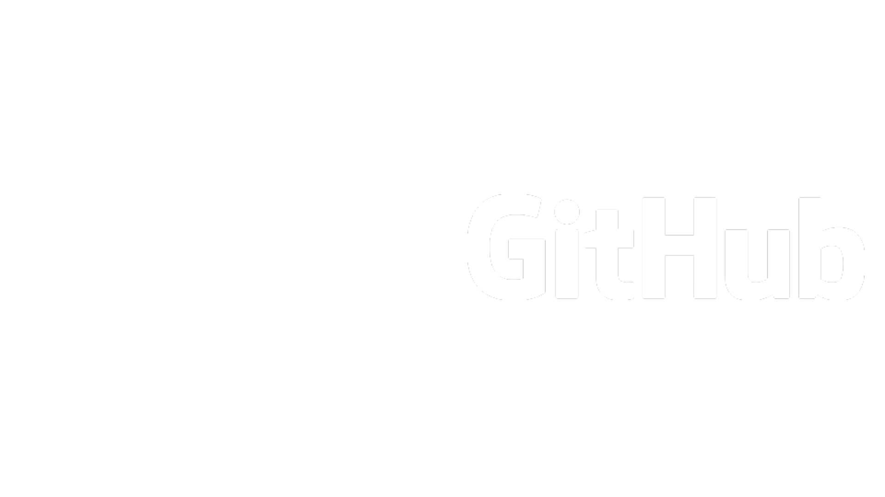

---

## Czym jest git?

### Git to rozproszony system kontroli wersji <!-- .element: class="fragment" data-fragment-index="1" -->

---v

**System kontroli wersji** - sposób śledzenia zmian np. w kodzie, albo dowolnych innych plikach. W tym zmian z różnych źródeł.

Przykładem mogą być dokumenty Google. <!-- .element: class="fragment" data-fragment-index="1" -->

---v


---v

**Rozproszony** system kontroli wersji - system kontroli wersji w którym każdy komputer ma pełną historię plików, co pozwala na usprawnienia w zarządzaniu wersjami

---

## Co to oznacza w praktyce?

---v

-   Git pozwala śledzić wszystkie zmiany w kodzie, zobaczyć kiedy zostały wprowadzone i przez kogo
-   Umożliwia rozdzielanie gałęzi kodu i ponowne ich łączenie z główną wersją <!-- .element: class="fragment" data-fragment-index="1" -->
-   Pozwala na współpracę w której każdy może pracować nad swoją częścią kodu i później połączyć ją z resztą <!-- .element: class="fragment" data-fragment-index="2" -->

---v


---

### Jak zacząć?

Należy najpierw oczywiście Gita zainstalować; można go pobrać z https://git-scm.org/downloads.

Po instalacji należy się upewnić, że Git jest w `PATH`!
<!-- .element: class="fragment" data-fragment-index="1" -->

---

### Pierwsze repo programisty

Aby moć skorzystać z możliwości Gita, należy utworzyć repozytorium.


**Repozytorium** (też często **repo**) jest folderem z dodatkowymi informacjami dla Gita, za pomocą których przechowuje on również historię plików.


Git jest narzędziem konsolowym, więc należy otworzyć terminal / wiersz poleceń i przejść do folderu w którym chcemy stworzyć repo.


Aby je utworzyć, należy użyć komendy `git init`.

NOTE: wspomnieć o GUI do Gita! Przykłady: GitKraken, GitHub Desktop, TortoiseGit

---

### Śledzenie zmian w plikach

Dodaliśmy nasz kod źródłowy - co teraz?
Musimy powiedzieć Gitowi, żeby śledził te nowe pliki, co możemy zrobić za pomocą
```shell
$ git add <PLIK | FOLDER>
```

Gdybyśmy przypadkiem dodali zły plik, możemy go wycofać ze śledzenia używając
```shell
$ git rm <PLIK | FOLDER>
```

---v

### Git ma trzy główne komponenty w repozytoriach

- repozytorium - folder w którym Git przechowuje historię plików <!-- .element: class="fragment" data-fragment-index="1" -->
- indeks - miejsce do przygotowywania commitów <!-- .element: class="fragment" data-fragment-index="2" -->
- working tree - pliki nad którymi właśnie pracujesz <!-- .element: class="fragment" data-fragment-index="3" -->

---v

### Podstawowy ciąg pracy w Git

1. modyfikowanie plików w working tree <!-- .element: class="fragment" data-fragment-index="1" -->
2. dodanie ich do indeksu aby mogły być uwzględnione w następnym commicie <!-- .element: class="fragment" data-fragment-index="2" -->
3. commit - pliki zostają przeniesione z indeksu do repozytorium <!-- .element: class="fragment" data-fragment-index="3" -->

---

### Główna waluta repo: commity

Po utworzeniu i zapisaniu naszych zmian, teraz musimy je . tzw. **commit** - prosto mowiąc, jest on migawką repozytorium.
W Git, wykonujemy commit za pomocą
```shell
$ git commit -m "<OPIS>"
```

Przedtem jednak, musimy mu powiedzieć kim jesteśmy - potrzebny jest username jak i e-mail:
```shell
$ git config --global user.name "Jan Kowalski"
$ git config --global user.email "jan.kowalski@tm1.edu.pl"
```
NOTE: wspomnieć o tym, że trzeba user.email musi się zgadzać z tym na GH!

---

### A teraz, kto wszystko zepsuł?

Z Gitem, odpowiedź jest łatwa: wystarczy użyć jednego z kilku narzędzi do badania commitów:

- `git log`
```shell
$ git log
commit 3ced38946f641021d7ee2ae5608d8a444675d931 (HEAD -> master)
Author: fbrzoz <63065775+fbrzoz@users.noreply.github.com>
Date:   Sat Oct 31 19:35:06 2020 +0100

    Add additional netcode
```
<!-- .element style="width:110%; overflow:hidden !important" -->

- `git reflog`
```shell
$ git reflog
3ced389 (HEAD -> master) HEAD@{0}: commit: Add netcode
d438591 HEAD@{1}: commit (initial): Add program entrypoint
```
<!-- .element style="width:110%; overflow:hidden !important" -->